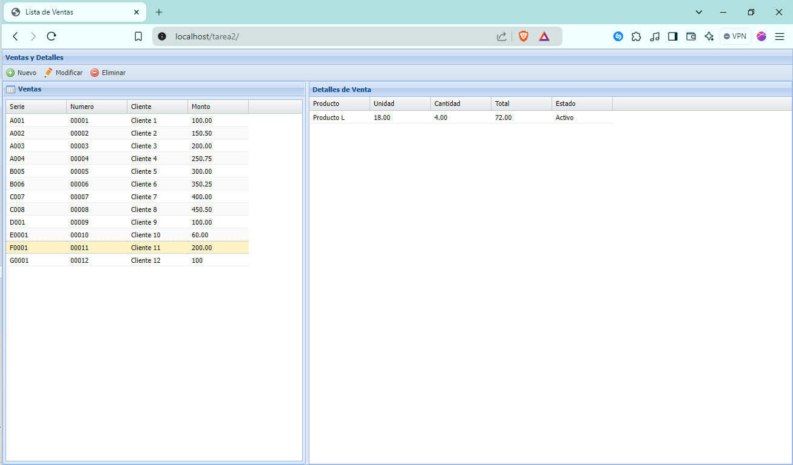

# Nombre del Proyecto

Venta - Detalle Venta CRUD ExtJS
## Requisitos

Asegúrate de tener instaladas las siguientes herramientas:

1. **XAMPP**: Paquete que incluye Apache, MySQL y PHP, utilizado para el desarrollo del backend.  
  **Versión**: XAMPP for Windows 8.0.30
  
2. **PostgreSQL**: Sistema de gestión de bases de datos utilizado para almacenar la información.  
  **Versión**: PostgreSQL 17.0-rc1

3. **Visual Studio Code**: Editor de código fuente para desarrollar y editar el código del proyecto.

4. **ExtJS**: Framework de JavaScript para construir la interfaz de usuario de la aplicación.

5. **PHP**: Lenguaje de scripting utilizado para las operaciones en el backend.

## Instalación

Este proyecto requiere que tengas XAMPP y PostgreSQL instalados y configurados para funcionar correctamente. Sigue los pasos a continuación para instalar y configurar estas herramientas.

### Instalación de XAMPP

1. **Descargar XAMPP**:
   - Ve a la [página de descargas de XAMPP](https://www.apachefriends.org/index.html).
   - Descarga la versión para Windows: `xampp-windows-x64-8.0.30-0-VS16-installer.exe`.

2. **Instalar XAMPP**:
   - Ejecuta el instalador descargado.
   - Sigue las instrucciones del asistente de instalación.
   - Durante la instalación, selecciona los componentes `Apache` y `PHP` (el componente `MySQL` no es necesario para este proyecto ya que usaremos PostgreSQL).

3. **Iniciar XAMPP**:
   - Abre el Panel de Control de XAMPP.
   - Inicia los servicios de `Apache` y `MySQL`. Asegúrate de que ambos servicios estén en ejecución.

### Instalación de PostgreSQL

1. **Descargar PostgreSQL**:
   - Ve a la [página de descargas de PostgreSQL](https://www.postgresql.org/download/windows/).
   - Descarga la versión para Windows: `postgresql-17.0-rc1-windows-x64.exe`.

2. **Instalar PostgreSQL**:
   - Ejecuta el instalador descargado.
   - Sigue las instrucciones del asistente de instalación.
   - Durante la instalación, asegúrate de tomar nota de la contraseña que establezcas para el usuario `postgres`.

3. **Iniciar PostgreSQL**:
   - El instalador debería haber creado un servicio de PostgreSQL que se inicia automáticamente. Verifica que PostgreSQL esté corriendo desde el "Administrador de Servicios" de Windows o usa pgAdmin para confirmar que la base de datos está activa.

### Configuración de PostgreSQL con XAMPP

1. **Configurar PHP para PostgreSQL**:
   - Abre el archivo `php.ini` en el directorio de instalación de XAMPP, por ejemplo, `C:\xampp\php\php.ini`.
   - Busca las siguientes líneas y descoméntalas (elimina el punto y coma `;` al inicio de la línea):
     ```ini
     extension=pgsql
     extension=pdo_pgsql
     ```
   - Guarda los cambios en `php.ini`.

2. **Reiniciar Apache**:
   - Regresa al Panel de Control de XAMPP.
   - Reinicia el servicio de `Apache` para aplicar los cambios realizados en `php.ini`.
## Configuración

### 1. Descargar el Código

1. **Clona o descarga el repositorio del proyecto desde GitHub:**
   ```bash
   https://github.com/fenyx144/CRUD-Trabajadores-ExtJS
2. **Cargar el Backup con pgAdmin**
Abrir pgAdmin:

- Inicia pgAdmin desde el menú de inicio de Windows o desde el acceso directo en tu escritorio.
- Conectarse al Servidor de PostgreSQL:

En el panel de navegación izquierdo, selecciona el servidor al que deseas conectar e ingresa tus credenciales si es necesario.
Cargar el Backup:

- Haz clic en Tools -> Backup y en la ventana de Restore, selecciona el archivo de backup basedatos.sql .
- Ajusta las opciones de restauración si es necesario y haz clic en Restore para comenzar el proceso.
3. **Lanzar XAMPP y PostgreSQL**
 Iniciar XAMPP:

- Abre el panel de control de XAMPP desde el menú de inicio o el acceso directo en tu escritorio.
- En el panel de control de XAMPP, haz clic en Start para iniciar los servicios de Apache y MySQL. Aunque el proyecto utiliza PostgreSQL, Apache es necesario para el backend.
Iniciar PostgreSQL:

- Abre el panel de control de PostgreSQL (si lo has instalado) y asegúrate de que el servicio de PostgreSQL esté en ejecución.
4. **Copiar la Carpeta del Código dentro de XAMPP**
- Localizar la Carpeta del Código:

- Navega a la carpeta donde descargaste o clonaste el código del proyecto.
- Copiar la Carpeta:

- Copia la carpeta del proyecto y pégala en la carpeta htdocs dentro del directorio de instalación de XAMPP (por ejemplo, C:\xampp\htdocs\).

- Abre el archivo conectar.php ubicado en  [proyecto]/bd/conectar.php
cambia $user y  $password segun tu configuración:
$host = 'localhost'; 
$port = '5432'; 
$dbname = 'postgres';
$user = 'postgres'; 
$password = 'admin';
5. **Ver el Proyecto en el Navegador**
- Abrir el Navegador Web:
- Ingresa la siguiente URL en la barra de direcciones: http://localhost/tarea1
## Imágenes

### Captura de Pantalla

Aquí hay una captura de pantalla del proyecto:


Cuando se hace click en una venta aparece su detalle:



Inserción de una nueva venta:


Edición de una venta con su detalle


Eliminación de una venta con sudetalle


